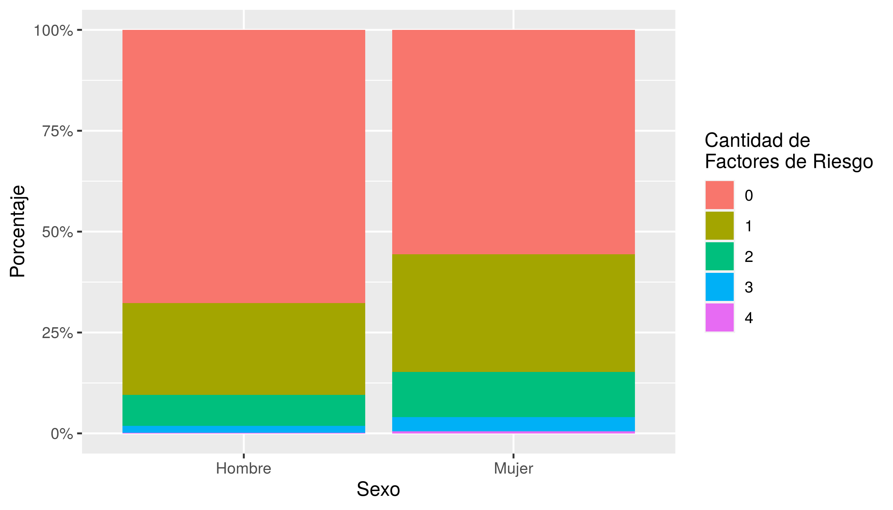
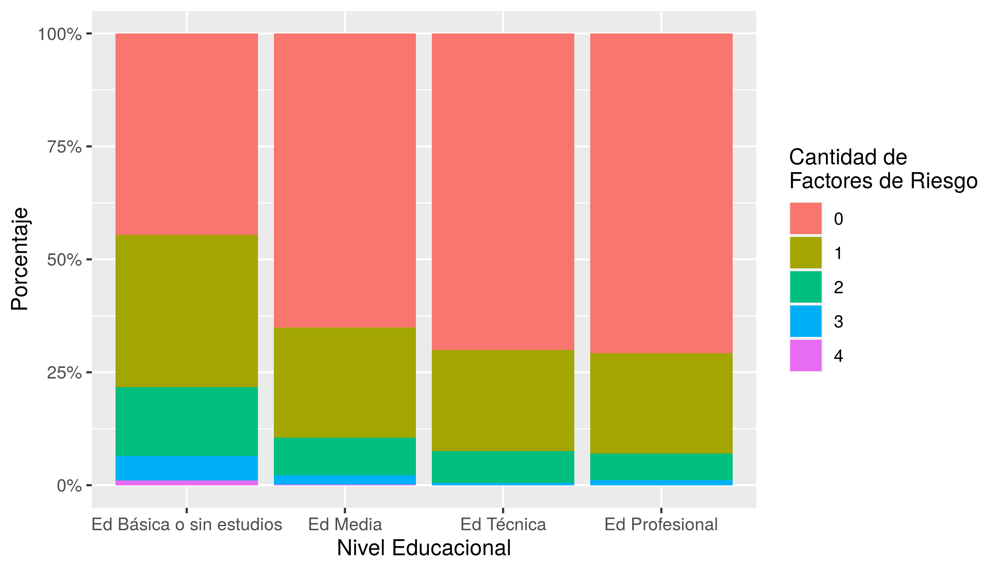
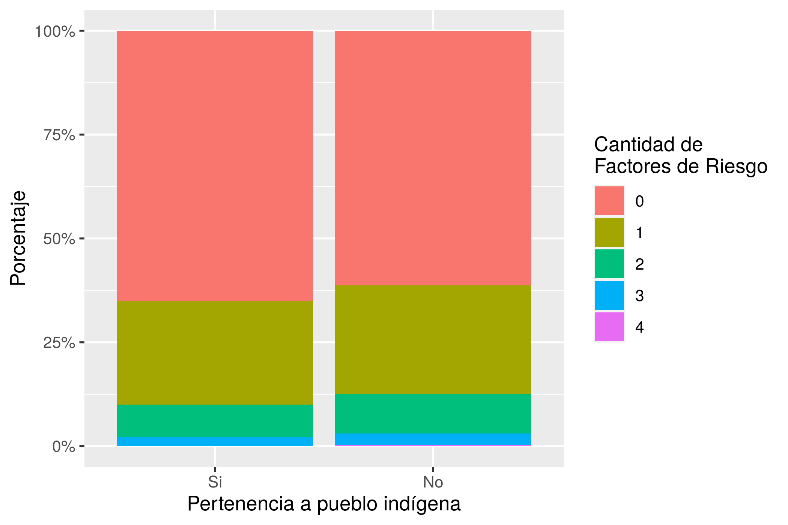
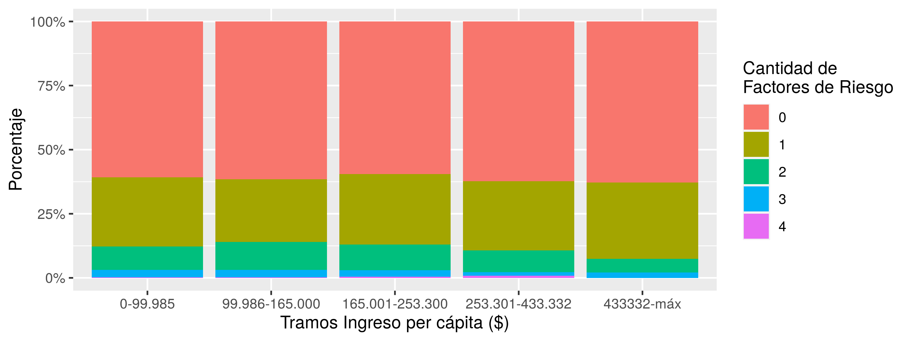

```{r setup, include=FALSE}
knitr::opts_chunk$set(echo = FALSE)
knitr::opts_knit$set(root.dir = rprojroot::find_rstudio_root_file())
library(dplyr)
```

```{r cargar-datos}
# Con este comando se carga el archivo (lista) que contiene los resultados
resultados <- readRDS("Datos/Datos de Análisis/resultados-reporte.rds")
```

# Introducción

### Objetivo
Observar la distribución porcentual de la cantidad de factores de riesgo de enfermedad grave por COVID-19, según sexo, nivel educacional, pertenencia a pueblos indígenas y nivel de ingreso per cápita en personas de 15 años y más que residen en Chile.

### Factores de Riesgo

Se utilizaron las principales comorbilidades descritas en pacientes que desarrollan cuadros graves por COVID-19 [@rod_briefreview_2020; @espinosa_prevalence_2020]:

* Hipertensión Arterial
* Enfermedad Cardiovascular
* Diabetes 
* Enfemedad Pulmonar

### Determinantes sociales
Los indicadores utilizados como determinantes sociales fueron extraídos del marco conceptual elaborado por Solar e Irwin -@solar_conceptual_2007 utilizado por la Organización Mundial de la Salud [-@organizacionmundialdelasalud_subsanar_2009].

* Sexo
* Nivel Educacional
* Pertenencia a pueblos Indígenas
* Ingreso per cápita

# Metodología

Se utilizó la Encuesta Nacional de Salud (ENS) 2016-2017 del Departamento de Salud Pública, y Centro de Encuestas y Estudios Longitudinales (CEEL) y Pontificia Universidad Católica de Chile (PUC). EstEN esta encuesta se utilizó una selección aleatoria y compleja (estratificada y multietápica por conglomerados), y es representativa de personas de 15 años y más, chilenas o extranjeras que residen en Chile.

Tanto los factores de riesgo, como los determinantes sociales fueron construidos a partir del autoreporte de enfermedades y datos socioeconómicos de la ENS 2017. 

\newpage

#### Variables utilizadas

|            Descripción de la variable       	| Nombre en base original 	|   Nuevo nombre  	|                                    Valores y recodificación                                   	| Nivel de Medición 	|
|:-------------------------------------------:	|:-----------------------:	|:---------------:	|:---------------------------------------------------------------------------------------------:	|:-----------------:	|
|       Factor de Expansión Formulario 1      	|      Fexp_F1p_Corr      	|     factor1     	|                                Números simples para ponderación                               	|     No Aplica     	|
|       Factor de Expansión Formulario 2      	|      Fexp_F2p_Corr      	|     factor2     	|                                Números simples para ponderación                               	|     No Aplica     	|
| Factor de Expansión Cruces Formulario 1 y 2 	|     Fexp_F1F2p_Corr     	|    factor1x2    	|                                Números simples para ponderación                               	|     No Aplica     	|
|             Nivel   Educacional             	|           as7           	|       educ      	| Se recodifica en: "Ed   Básica o sin estudios", "Ed Media", "Ed Técnica" y   "Ed Profesional" 	|      Ordinal      	|
|                     Sexo                    	|           Sexo          	|       sexo      	|                                      1= hombre, 2= mujer                                      	|      Nominal      	|
|            Ingreso   total hogar            	|           as27          	|     ingresos    	|                         Recodificada a tramos   de ingreso per cápita                         	|      Ordinal      	|
|        Número   de personas por hogar       	|          n_per          	| npersonas_hogar 	|                                                                                               	|                   	|
|      Pertenencia   a pueblos indígenas      	|            c6           	|    pueblosind   	|                                          1.Sí   0.No                                          	|      Nominal      	|
|  Enfermedad Pulmonar Crónica Autoreportada  	|          m9p17A         	|   plmnr_cronc   	|                      Se construye nueva variable: Enfemedad Respiratoria                      	|      Nominal      	|
|              Asma Autoreportada             	|          m9p18A         	|       asma      	|                     Se construye nueva variable:   Enfemedad Respiratoria                     	|      Nominal      	|
|      Hipertensión Arterial Autorportada     	|            h2           	|       hta       	|                                           1.Sí 0.No                                           	|     Nominal       	|
|           Diabetes  Autoreportada           	|           di3           	|        dm       	|                                           1.Sí 0.No                                           	|      Nominal      	|
|            Infarto   al Miocardio           	|            d1           	|       iam       	|                     Se construye nueva variable: Enfemedad Cardiovascular                     	|      Nominal      	|
|         Accidente   Cerebro Vascular        	|            d4           	|       acv       	|                     Se construye nueva variable: Enfemedad Cardiovascular                     	|      Nominal      	|
|       Enfermedad   Vascular Periférica      	|            d7           	|       evp       	|                     Se construye nueva variable: Enfemedad Cardiovascular                     	|      Nominal      	|
\newpage

# Gráficos 

### Gráfico 1

#### Gráfico de barras apilada al 100%, subdividido por cantidad de factores de riesgo según sexo.



### Gráfico 2

#### Gráfico de barras apilada al 100%, subdividido por cantidad de factores de riesgo según nivel educacional.



\newpage

### Gráfico 3

#### Gráfico de barra apilada al 100%, subdividido por cantidad de factores de riesgo según pertenencia a pueblos indígenas.


### Gráfico 4

#### Gráfico de barra apilada al 100%, subdividido por cantidad de factores de riesgo según tramo de ingreso per cápita.


\newpage

# Anexos


```{r tabla1}
knitr::kable(resultados[[5]], digit=2, caption = "Tabla Cruzada: Número de Factotes de Riesgo para enfermedad grave COVID-19 según sexo")
```

```{r tabla2}
knitr::kable(resultados[[6]], digit=2, caption = "Tabla Cruzada: Número de Factotes de Riesgo para enfermedad grave COVID-19 según Nivel Educacional")
```

\newpage

```{r tabla3}
knitr::kable(resultados[[7]], digit=2, caption = "Tabla Cruzada: Número de Factotes de Riesgo para enfermedad grave COVID-19 según pertenencia a pueblo indígena")
```

```{r tabla4}
knitr::kable(resultados[[8]], digit=2, caption = "Tabla Cruzada: Número de Factotes de Riesgo para enfermedad grave COVID-19 según Tramos de Ingresos per cápita")
```

\newpage

# Referencias

```{r, echo=FALSE}
rm(list=ls())
```
