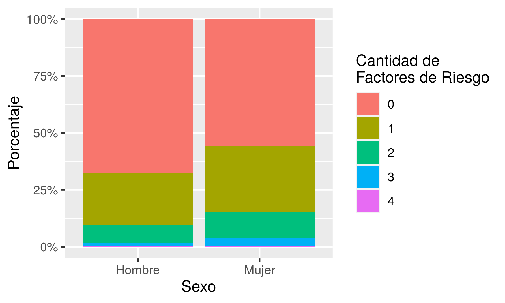
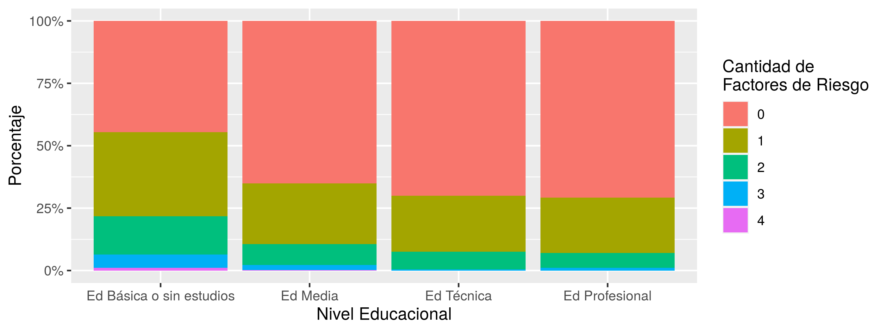

```{r setup, include=FALSE}
knitr::opts_chunk$set(echo = FALSE)
knitr::opts_knit$set(root.dir = rprojroot::find_rstudio_root_file())
library(dplyr)
```

```{r cargar-datos}
# Con este comando se carga el archivo (lista) que contiene los resultados
resultados <- readRDS("Datos/Datos de Análisis/resultados-reporte.rds")
```

# Introducción

##Objetivo
Describir la cantidad de factores de riesgo de enfermerdad grave por COVID-19 según sexo, nivel educacional, pertenencia a pueblos indígenas y 

## Factores de Riesgo

Se utilizaron las principales comorbilidades descritas en pacientes que desarrollan cuadros graves por COVID-19 (@rod_briefreviw_2020; @espinosa_prevalence_2020):

* Hipertensión Arterial
* Enfermedad Cardiovascular
* Diabetes Mellitus 2
* Enfemedad Pulmonar

## Determinantes sociales
Los indicadores utilizados como determinantes sociales fueron extraídos del marco conceptual elaborado por Solar e Irwin -@solar_conceptual_2007. 

* Nivel de Ingresos
* Nivel Educacional
* Pertenencia a pueblos Indígenas
* Ingreso per cápita

#Metodología

Se utilizó la Encuesta Nacional de Salud (ENS) 2016-2017 del Departamento de Salud Pública, y Centro de Encuestas y Estudios Longitudinales (CEEL) y Pontificia Universidad Católica de Chile (PUC). EstEN esta encuesta se utilizó una selección aleatoria y compleja (estratificada y multietápica por conglomerados), y es representativa de personas de 15 años y más, chilenas o extranjeras que residen en Chile.

Tanto los factores de riesgo, como los determinantes sociales fueron construidos a partir del autoreporte de enfermedades y datos socioeconómicos de la ENS 2017. 

# Gráficos

###Gráfico 1

Cantidad de grupos de riesgo por COVID-19






\newpage

# Tablas de resultados

Con la función `knitr::kable(objeto_a_imprimir)`, podemos imprimir una tabla en formato *R Markdown*.

Para ello hay que tener clara la posición de los resultados en el archivo tipo "lista" que se creó en el tercer código (*3-construccion-resultados.R*).

```{r tabla9}

  
```

\newpage

#Anexos

```{r tabla1}
knitr::kable(resultados[[5]], digit=2, caption = "Tabla Cruzada: Número de Factotes de Riesgo para enfermedad grave COVID-19 según sexo")
```

```{r tabla2}
knitr::kable(resultados[[6]], digit=2, caption = "Tabla Cruzada: Número de Factotes de Riesgo para enfermedad grave COVID-19 según Nivel Educacional")
```

```{r tabla3}
knitr::kable(resultados[[7]], digit=2, caption = "Tabla Cruzada: Número de Factotes de Riesgo para enfermedad grave COVID-19 según pertenencia a pueblo indígena")
```

```{r tabla4}
knitr::kable(resultados[[8]], digit=2, caption = "Tabla Cruzada: Número de Factotes de Riesgo para enfermedad grave COVID-19 según Tramos de Ingresos per cápita")
```

\newpage

# Referencias

```{r, echo=FALSE}
rm(list=ls())
```
