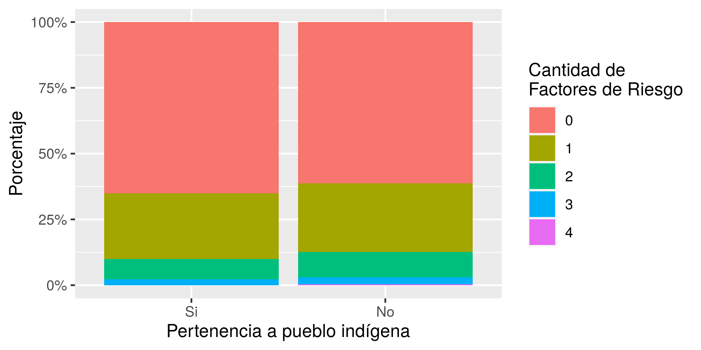

```{r setup, include=FALSE}
knitr::opts_chunk$set(echo = FALSE)
knitr::opts_knit$set(root.dir = rprojroot::find_rstudio_root_file())
library(dplyr)
```

```{r cargar-datos}
# Con este comando se carga el archivo (lista) que contiene los resultados
resultados <- readRDS("Datos/Datos de Análisis/resultados-reporte.rds")
```

# Introducción

##F
## Determinantes sociales
Los indicadores utilizados como determinantes sociales corresponden a:
- Nivel de Ingresos
- Nivel Educacional
- Pertenencia a pueblos Indígenas
- Ingreso per cápita


En este ejemplo se muestra como introducir referencias bibliográficas [@dancona_alisis_2002], así com o la inclusión de resultados tipo tablas y gráficos [@hair_alisis_1999; @vivanco_analisis_1996].

# Gráficos

La lógica para incorporar los gráficos es la misma.

También podemos agregar el mismo gráfico, pero directamente desde el archivo de imagen desde el directorio `Output`





\newpage

# Tablas de resultados

Con la función `knitr::kable(objeto_a_imprimir)`, podemos imprimir una tabla en formato *R Markdown*.

Para ello hay que tener clara la posición de los resultados en el archivo tipo "lista" que se creó en el tercer código (*3-construccion-resultados.R*).

```{r tabla9}

ENS_analisis<-readRDS("Datos/Datos de Análisis/ENS2017_analisis.RDS")

library(kableExtra)
library(magrittr)
knitr::kable (tb(with(ENS_analisis, stby(data = Risk, INDICES = sexo_factor, 
                                  FUN = descr,transpose = TRUE, stats = c("mean", "med", "sd", "cv"),
                                  weights = ENS_analisis$factor1x2, style = 'rmarkdown')), order = 2))

knitr::kable (table1, digit=2)
  
```

\newpage

#Anexos

```{r tabla1}
knitr::kable(resultados[[5]], digit=2, caption = "Tabla Cruzada: Número de Factotes de Riesgo para enfermedad grave COVID-19 según sexo")
```

```{r tabla2}
knitr::kable(resultados[[6]], digit=2, caption = "Tabla Cruzada: Número de Factotes de Riesgo para enfermedad grave COVID-19 según Nivel Educacional")
```

```{r tabla3}
knitr::kable(resultados[[7]], digit=2, caption = "Tabla Cruzada: Número de Factotes de Riesgo para enfermedad grave COVID-19 según pertenencia a pueblo indígena")
```

```{r tabla4}
knitr::kable(resultados[[8]], digit=2, caption = "Tabla Cruzada: Número de Factotes de Riesgo para enfermedad grave COVID-19 según Tramos de Ingresos per cápita")
```

\newpage

# Referencias

```{r, echo=FALSE}
rm(list=ls())
```
